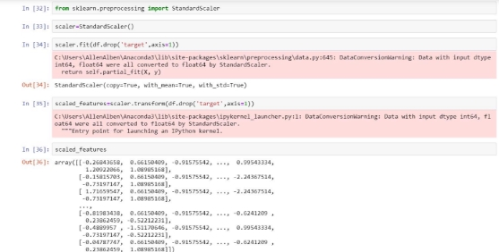

**HEART DISEASE PREDICTION AND COMPARISON OF ALGORITHMS** 

**KNN,SVM AND RANDOM FOREST** 

**PROBLEM DEFINITION** 

The aim of the project is to classify if the person has a heart disease or not. Along with this we also want to compare the results of three algorithms which are KNN,SVM and RANDOM FOREST CLASSIFIER on the basis of precision and accuracy.  

This data set dates from 1988 and consists of four databases: Cleveland, Hungary, Switzerland, and Long Beach V. It contains 76 attributes, including the predicted attribute, but all published experiments refer to using a subset of 14 of them. The "target" field refers to the presence of heart disease in the patient. It is integer valued 0 = no disease and 1 = disease.

Attributes that are present in the dataset- age,sex,chest pain type(4types),resting bp,serum cholesterol,fasting blood sugar,resting electrocardiographic results,maximum heart rate received,exercise induced angina,oldpeak = ST depression induced by exercise relative to rest,

The slope of the peak exercise ST segment,number of major vessels,thal: 0 = normal; 1 = fixed defect; 2 = reversible defect 

**DATASET**  

Heart Diseases 

LINK -[ https://www.kaggle.com/johnsmith88/heart-disease-dataset ](https://www.kaggle.com/johnsmith88/heart-disease-dataset)

First 10 rows including all the columns

This dataset was obtained from the UCI archive and is also available on kaggle too. It consists of data of 1025 individuals. This database contains 76 attributes, but all published experiments refer to using a subset of 14 of them. In particular, the Cleveland database is the only one that has been used by ML researchers to this date. The "goal" field refers to the presence of heart disease in the patient. It is integer-valued from 0 (no presence) to 4. Experiments with the Cleveland database have concentrated on simply attempting to distinguish presence (values 1,2,3,4) from absence (value 0).

**ALGORITHM USED** 

Our objective is to classify if the person has heart disease or not and we therefore use 3 algorithms for the same to also create a comparison

**1.Support Vector Machine**

Support vector machines (SVMs) is a set of supervised learning methods which can be used for[ classification,](https://scikit-learn.org/stable/modules/svm.html#svm-classification)[ regression ](https://scikit-learn.org/stable/modules/svm.html#svm-regression)and[ outliers detection.](https://scikit-learn.org/stable/modules/svm.html#svm-outlier-detection)

SVM or Support Vector Machine is a linear model for classification and regression problems. It can solve linear and non-linear problems and work well for many practical problems. The idea of SVM is simple: The algorithm creates a line or a hyperplane which separates the data into classes. Assuming that there are data points which are already labelled (as this is supervised learning). Our purpose is to divide them into two seperate classes with homogeneous data in each class and also teach the model to classify the new data into one of these using learning and modelling. A Support Vector Machine (**SVM**) performs classification by finding the **hyperplane** that maximizes the margin between the two classes. The vectors (cases) that define the **hyperplane** are the support vectors. The **vectors** (cases) that define the hyperplane are the **support vectors**.Extend the above definition for non-linearly separable problems: have a penalty term for misclassifications. It calculates the distance between the two opposite classes to create a margin.The **SVM** in particular defines the criterion to be looking for a decision surface that is maximally far away from any data point. This distance from the decision surface to the closest data point determines the **margin** of the classifier.

In addition to performing[ linear classification,](https://en.wikipedia.org/wiki/Linear_classifier) SVMs can efficiently perform a non-linear classification using what is called the[ kernel trick,](https://en.wikipedia.org/wiki/Kernel_method#Mathematics:_the_kernel_trick) implicitly mapping their inputs into high- dimensional feature spaces.

The advantages of support vector machines are:

- Effective in high dimensional spaces. 
- Still effective in cases where the number of dimensions is greater than the number of samples. 
- Uses a subset of training points in the decision function (called support vectors), so it is also memory efficient. 
- Versatile: different[ Kernel functions ](https://scikit-learn.org/stable/modules/svm.html#svm-kernels)can be specified for the decision function. Common kernels are provided, but it is also possible to specify custom kernels. 

**2. K Nearest Neighbors** 

K-nearest neighbors (KNN) algorithm is a part of a supervised learning algorithm which can be used for both classification as well as regression predictive problems. However, it is mainly used for classification predictive problems in industry. These are the properties of KNN

`   `1.Lazy learning algorithm − KNN is a lazy learning algorithm because it does not have a       specialized training phase and uses all the data for training while classification.

2.Non-parametric learning algorithm − KNN is also a non-parametric learning algorithm because it doesn’t assume anything about the underlying data.

Predictions are made for a new instance (x) by searching through the entire training set for the K most similar instances (the neighbors) and summarizing the output variable for those K instances. For regression this might be the mean output variable, in classification this might be the mode (or most common) class value.

To determine which of the K instances in the training dataset are most similar to a new input a distance measure is used. For real-valued input variables, the most popular distance measure is Euclidean distance.

Euclidean distance is calculated as the square root of the sum of the squared differences between a new point (x) and an existing point (xi) across all input attributes j.

EuclideanDistance(x, xi) = sqrt( sum( (xj – xij)^2 ) )

Other popular distance measures include:

- **Hamming Distance**: Calculate the distance between binary vectors. 
- **Manhattan Distance**: Calculate the distance between real vectors using the sum of their absolute difference. Also called City Block Distance 
- **Minkowski Distance**: Generalization of Euclidean and Manhattan distance 

There are many other distance measures that can be used, such as Tanimoto, Jaccard, Mahalanobis and cosine distance. You can choose the best distance metric based on the properties of your data. If you are unsure, you can experiment with different distance metrics and different values of K together and see which mix results in the most accurate models.

The red star represents our test data point whose value is ( 2 , 1 , 3 ) . Our test point is surrounded by yellow and blue dots which represent our 2 classes. Now , we find out the distance from our test point to each of the dots present on the graph. Since there are 10 dots , we get 10 distances. We determine the lowest distance and predict that it belongs to the same class of its nearest neighbor. If a yellow dot is the closest ,then we predict that our test data point is also a yellow dot.

But , in some cases , you can also get two distances which are exactly equal. Here , we take into consideration a third data point and calculate its distance from our test data. In the above diagram , our test data lies in between the yellow and the blue dot . We considered the distance from thee 3rd data point and predicted that our test data is of class BLUE . Advantages of kNN 

1. Simple Implementation. 
1. Makes no prior assumption of the data. 

3. **Random Forest Classifier** 

Most votes become our model’s prediction.Random forest, like its name implies, consists of a large number of individual decision trees that operate as an ensemble. ***Ensembled algorithms*** are those which combine more than one algorithms of the same or different kind for classifying objects. For example, running predictions over Naive Bayes, SVM and Decision Tree and then taking a vote for final consideration of class for the test object. Each individual tree in the random forest spits out a class prediction and the class with the .A large number of relatively uncorrelated models (trees) operating as a committee will outperform any of the individual constituent models.

The low correlation between models is the key. Just like how investments with low correlations (like stocks and bonds) come together to form a portfolio that is greater than the sum of its parts, uncorrelated models can produce ensemble predictions that are more accurate than any of the individual predictions. The reason for this wonderful effect is that the trees protect each other from their individual errors (as long as they don’t constantly all err in the same direction). While some trees may be wrong, many other trees will be right, so as a group the trees are able to move in the correct direction. So the prerequisites for random forest to perform well are:

1. There needs to be some actual signal in our features so that models built using those features do better than random guessing. 
1. The predictions (and therefore the errors) made by the individual trees need to have low correlations with each other. 

Bagging stands for *bootstrap aggregation*. The aim is the same as for pruning. We want to reduce the variance of a decision tree. By the way we can use bagging for any kinds of learning algorithms. The principle is that we can reduce the variance by averaging a set of observations.

**Proposed Architecture** 

**1.**Obtain the dataset of the patients 2. Perform data analysis and cleaning of data 3.Perform the different algorithms (SVM,KNN,Random Forest Classifier) 4. Prediction of the patient’s health - that is if the patient has disease or not

**CODE**

` `**RESULTS** 

From the above implementation of three different algorithms,we compare the different values of accuracy values

KNN provides the highest value of accuracy 

**DISCUSSIONS**

Each and every dataset has its own limitations which a particular machine learning algorithm can make use of to achieve maximum accuracy. In this case, where we had data of 1025 individuals and we were able to notice that the algorithm which provides the highest accuracy and thereby the best performance for this particular dataset was the K-Nearest Neighbours algorithm. 

In SVM. Two classes were created where one class is people with heart disease and other without heart disease. 

In KNN, with groups are made based on characteristics with a particular value of k. 

In Random Forest Classifier, a large number of decision trees are made to arrive at a conclusion if the person has heart disease or not.

**Accuracy and precision comparison between KNN, SVM, Random Forest:** 

